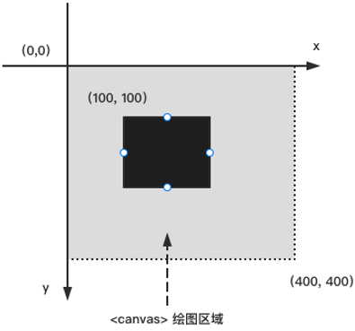
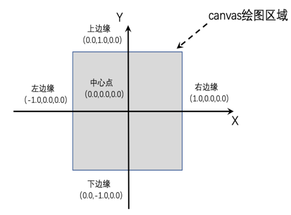
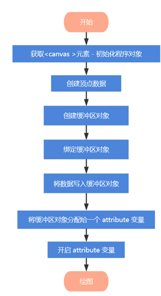
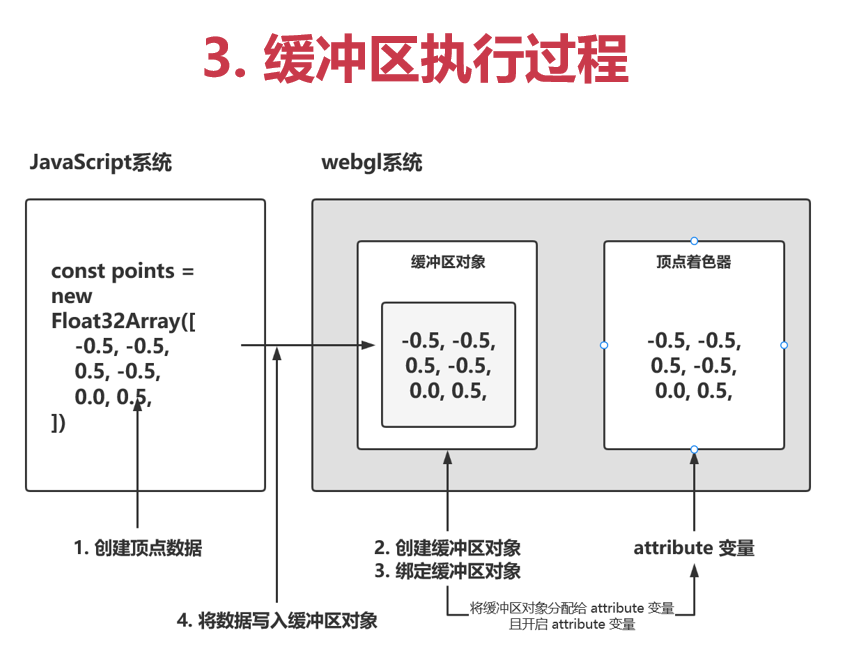

## 给画布换个颜色

1.最短的webgl程序

gl.clear(gl.COLOR_BUFFER_BIT)和gl.clearColor(0,0,0,1)   清空颜色缓冲区

gl.clear(gl.DEPTH_BUFFER_BIT)和gl.clearDepth(1) 清空深度缓冲区

gl.clear(gl.STENCIL_BUFFER_BIT)和gl.clearStencil(0) 清空函数缓冲区


## 通过webgl绘制一个点

- 顶点着色器：通过计算获取位置信息，用来描述顶点的特性。顶点 是指二维三维空间中的一个点，可以理解为一个个坐标

- 片元着色器：通过计算获取颜色信息，进行逐片元处理程序。 片元 可以理解为一个个像素

  源码

  ```javascript
  	const ctx = document.getElementById('canvas');
      const gl = ctx.getContext('webgl');
  
      // 着色器
      // 创建着色器源码
      const VERTEX_SHADER_SOURCE = `
      // 必须要存在 main 函数
      void main() {
      // 要绘制的点的坐标
      gl_Position = vec4(0.0, 0.0, 0.0, 1.0);
      // 点的大小
      gl_PointSize = 60.0;
      }
      `; // 顶点着色器
      //  gl_Position vec4(0.0,0.0,0.0,1.0)  x, y, z, w齐次坐标 (x/w, y/w, z/w)
  
      // gl_FragColor vec4(1.0,0.0,0.0,1.0) r, g, b, a
          const FRAGMENT_SHADER_SOURCE = `
          void main() {
          gl_FragColor = vec4(1.0, 0.0, 0.0, 1.0);
          }
          `; // 片元着色器
  
      // 创建着色器
      const vertexShader = gl.createShader(gl.VERTEX_SHADER);
      const fragmentShader = gl.createShader(gl.FRAGMENT_SHADER);
  
      // 指定顶点着色器的源码
      gl.shaderSource(vertexShader, VERTEX_SHADER_SOURCE);
      // 指定片元着色器的源码
      gl.shaderSource(fragmentShader, FRAGMENT_SHADER_SOURCE);
  
      gl.compileShader(vertexShader);
      gl.compileShader(fragmentShader);
  
      // 创建一个程序对象
      const program = gl.createProgram();
  
      gl.attachShader(program, vertexShader);
      gl.attachShader(program, fragmentShader);
  
      // 将着色器与js进行联系
      gl.linkProgram(program);
  
      // 利用
      gl.useProgram(program);
  
  		// 执行绘制
        // 要绘制的图形是什么， 从哪个开始，   使用几个顶点
        gl.drawArrays(gl.POINTS, 0, 1);
  ```

  从执行绘制开始以上都是公用代码可以对其进行封装使用！封装完后如下

  ```javascript
  function initShader(gl, VERTEX_SHADER_SOURCE, FRAGMENT_SHADER_SOURCE) {
    const vertexShader = gl.createShader(gl.VERTEX_SHADER);
    const fragmentShader = gl.createShader(gl.FRAGMENT_SHADER);
  
    gl.shaderSource(vertexShader, VERTEX_SHADER_SOURCE); // 指定顶点着色器的源码
    gl.shaderSource(fragmentShader, FRAGMENT_SHADER_SOURCE); // 指定片元着色器的源码
  
    // 编译着色器
    gl.compileShader(vertexShader);
    gl.compileShader(fragmentShader);
  
    // 创建一个程序对象
    const program = gl.createProgram();
  
    gl.attachShader(program, vertexShader);
    gl.attachShader(program, fragmentShader);
  
    gl.linkProgram(program);
  
    gl.useProgram(program);
  
    return program;
  }
  
  ```

  ## webGl 三维坐标系
  
  1.我们认识到的canvas是二维坐标系，如图下所示
  
  
  
  2.然后就是webgl的三维坐标系
  
  

## attibute变量

```javascript

        const ctx = document.getElementById('canvas');
        const gl = ctx.getContext('webgl');

        /* 创建着色器 */
        const VERTEX_SHADER_SOURCE = `
            // 只传递顶点数据
            attribute vec4 aPosition;
            void main() {
                gl_Position = aPosition;
                gl_PointSize = 10.0;
            }
        `;// 顶点着色器

        const FRAGMENT_SHADER_SOURCE = `
            void main() {
                gl_FragColor = vec4(1.0,0.0,0.0,1.0);
            }
        `;// 片元着色器

        const program = initShader(gl, VERTEX_SHADER_SOURCE, FRAGMENT_SHADER_SOURCE)

        const aPosition = gl.getAttribLocation(program, 'aPosition');

        // gl.vertexAttrib4f(aPosition, 0.5,0.5,0.0,0.8) // rgba
        // gl.vertexAttrib3f(aPosition, 0.5,0.5,0.0)
        // gl.vertexAttrib2f(aPosition, 0.5,0.5)
        // gl.vertexAttrib1f(aPosition, 0.5);

        let x = -1.0;
        let y = -1.0;
        setInterval(() => {
            x += 0.1;
            y += 0.2;
            if (x > 1.0) {
                x = -1.0;
            }
            if (y > 1.0) {
                y = -1.0;
            }
            gl.vertexAttrib2f(aPosition, x,y)
            gl.drawArrays(gl.POINTS, 0, 1);

        }, 500);


```

控制位置信息

## uniform

```javascript

        const ctx = document.getElementById('canvas');
        const gl = ctx.getContext('webgl');

        /* 创建着色器 */
        const VERTEX_SHADER_SOURCE = `
            // 只传递顶点数据
            attribute vec4 aPosition;
            void main() {
                gl_Position = aPosition;
                gl_PointSize = 10.0;
            }
        `;// 顶点着色器

        const FRAGMENT_SHADER_SOURCE = `
            precision mediump float;
            uniform vec2 uColor;
            void main() {
                gl_FragColor = vec4(uColor.r, uColor.g, 0.0,1.0); // vec4
            }
        `;// 片元着色器

        const program = initShader(gl, VERTEX_SHADER_SOURCE, FRAGMENT_SHADER_SOURCE)

        const aPosition = gl.getAttribLocation(program, 'aPosition'); // 位置信息

        const uColor = gl.getUniformLocation(program, 'uColor'); // 颜色信息
        
        const points = [];
        ctx.onclick = function(ev) {
            // 坐标
            const x = ev.clientX
            const y = ev.clientY

            const domPosition = ev.target.getBoundingClientRect();

            const domX = x - domPosition.left
            const domY = y - domPosition.top;

            const halfWidth = ctx.offsetWidth / 2
            const halfHeight = ctx.offsetHeight / 2

            const clickX = (domX - halfWidth) / halfWidth
            const clickY = (halfHeight - domY) / halfHeight

            points.push({
                clickX, clickY
            })

            for (let i = 0; i < points.length; i++) {
                gl.vertexAttrib2f(aPosition, points[i].clickX, points[i].clickY); // 设置位置信息
                gl.uniform2f(uColor, points[i].clickX, points[i].clickY); // 这边是rgba的颜色值
                gl.drawArrays(gl.POINTS, 0, 1);
            }
        }


```

控制颜色信息

## 通过鼠标控制点

```javascript
const ctx = document.getElementById('canvas');
const gl = ctx.getContext('webgl');

/* 创建着色器 */
const VERTEX_SHADER_SOURCE = `
// 只传递顶点数据
attribute vec4 aPosition;
void main() {
gl_Position = aPosition;
gl_PointSize = 10.0;
}
`;// 顶点着色器

const FRAGMENT_SHADER_SOURCE = `
void main() {
gl_FragColor = vec4(1.0,0.0,0.0,1.0);
}
`;// 片元着色器

const program = initShader(gl, VERTEX_SHADER_SOURCE, FRAGMENT_SHADER_SOURCE)

const aPosition = gl.getAttribLocation(program, 'aPosition');

/* 鼠标点击后，我们要将点中的宽度，高度值转换为顶点着色的的[-1, 1]这个区间段的值， 类似下面的计算*/
/*
            0 200 400

            -1 0 1

            -200 0 200

            -1 0 1

            需要先 -200 （当前画布的宽度） 然后再 除以 200

            1 0 -1

            0 200 400

            200 0 -200 / 200

            需要先让 200 减这个数，然后再 / 200

        * */
const points = [];
ctx.onclick = function(ev) {
    // 坐标
    const x = ev.clientX;
    const y = ev.clientY;

    const domPosition = ev.target.getBoundingClientRect();
    const domX = x - domPosition.left;
    const domY = y - domPosition.top;

    const halfWidth = ctx.offsetWidth / 2
    const halfHeight = ctx.offsetHeight / 2

    const clickX = (domX - halfWidth) / halfWidth
    const clickY = (halfHeight - domY) / halfHeight

    points.push({
        clickX, clickY
    })

    for(let i = 0; i < points.length; i++) {
        gl.vertexAttrib2f(aPosition, points[i].clickX, points[i].clickY);
        gl.drawArrays(gl.POINTS, 0, 1);
    }
};
```


## 贪吃蛇案例

```javascript
<!DOCTYPE html>
<html lang="en">
  <head>
    <meta charset="UTF-8" />
    <meta http-equiv="X-UA-Compatible" content="IE=edge" />
    <meta name="viewport" content="width=device-width, initial-scale=1.0" />
    <title>Document</title>
    <script src="../lib/index.js"></script>
    <style>
      * {
        margin: 0;
        padding: 0;
      }
      #canvas {
        margin: 50px auto 0;
        display: block;
        background: rgb(221, 221, 214);
      }
    </style>
  </head>
  <body>
    <canvas id="canvas" width="500" height="500"> 此浏览器不支持canvas </canvas>

    <script>
      const ctx = document.getElementById("canvas");
      const gl = ctx.getContext("webgl");

      /* 创建着色器 */
      const VERTEX_SHADER_SOURCE = `
            // 只传递顶点数据
            attribute vec4 aPosition;
            void main() {
                gl_Position = aPosition;
                gl_PointSize = 10.0;
            }
        `; // 顶点着色器

      const FRAGMENT_SHADER_SOURCE = `
            precision mediump float;
            uniform vec2 uColor;
            void main() {
                gl_FragColor = vec4(uColor.r, uColor.g, 0.0,1.0); // vec4
            }
        `; // 片元着色器

      const program = initShader(gl, VERTEX_SHADER_SOURCE, FRAGMENT_SHADER_SOURCE);

      const aPosition = gl.getAttribLocation(program, "aPosition"); // 位置信息
      const uColor = gl.getUniformLocation(program, "uColor"); // 颜色信息

      /* 蛇的长度 */
      let points = [
        {
          x: 0,
          y: 0,
        },
      ];
      
      /* 食物的坐标 */
      const random = {
        isConnect: true,
      };

      /* 移动的速度 */
      let originSpeed = 0.02;

      /* 行动的速度 */
      let speed = originSpeed;

      /* 移动的方向 */
      let direction = "x";

      /* 允许吃掉食物的误差范围 */
      let base = 1.5;

      document.onkeydown = (event) => {
        switch (event.keyCode) {
          case 37: // 左
            direction = "x";
            speed = -originSpeed;
            break;
          case 38: // 上
            direction = "y";
            speed = originSpeed;
            break;
          case 39: // 右
            direction = "x";
            speed = originSpeed;
            break;
          case 40: // 下
            direction = "y";
            speed = -originSpeed;
            break;
        }
      };

      const createRandom = () => {
        if (random.isConnect) {
          random.x = Math.random() * 2 - 1; // (0, 2) - 1 = (-1, 1)
          random.y = Math.random() * 2 - 1;
          random.isConnect = false;
        }
      };

      let timer = null;
      const start = () => {
        timer = setInterval(() => {
          if (points[0].x > 1.0 || points[0].x < -1.0 || points[0].y < -1.0 || points[0].y > 1.0) {
            alert("游戏结束！");
            restart();
          }

          /* 判断是否碰上食物, 都是蛇头有没有碰上, points[0].x points[0].y都是移动的点 */
          if (
            // 4个方向上完全碰上，应该是超过去了
            points[0].x > random.x - base * originSpeed && // 往右超
            points[0].x < random.x + base * originSpeed && // 左超
            points[0].y < random.y + base * originSpeed && // 下超
            points[0].y > random.y - base * originSpeed // 上超
          ) {
            /* 碰上了就营造新的点，其实新的点都是放在第二位 */
            points.push({ x: random.x, y: random.y });
            random.isConnect = true;
          }
          createRandom();
          draw();
        }, 100);
      };
      start();

      const draw = () => {
        gl.vertexAttrib3f(aPosition, random.x, random.y, 0.0); // 记录食物的位置信息
        gl.uniform2f(uColor, Math.random(), Math.random()); // 这边是rgba的颜色值
        gl.drawArrays(gl.POINTS, 0, 1); // 绘制位置信息

        let prex = 0;
        let prey = 0;
        /* 让连成蛇的关键代码 */
        for (let i = 0; i < points.length; i++) {
          if (i === 0) {
            prex = points[0].x;
            prey = points[0].y;
            points[0][direction] += speed; // 控制方向
          } else {
            /* 连线 */
            let { x, y } = points[i]; // 先拿出来
            points[i].x = prex;
            points[i].y = prey;
            prex = x; // 把新的随机点给了他
            prey = y;
          }
          console.log(points, 159);
          gl.vertexAttrib3f(aPosition, points[i].x, points[i].y, 0.0); // 控制位置信息
          gl.uniform2f(uColor, points[i].x, points[i].y); // 这边是rgba的颜色值
          gl.drawArrays(gl.POINTS, 0, 1);
        }
      };

      const restart = () => {
        clearInterval(timer);
        points = [{ x: 0, y: 0 }];
      };
    </script>
  </body>
</html>

```

## 使用缓冲区对象-绘制多个点



